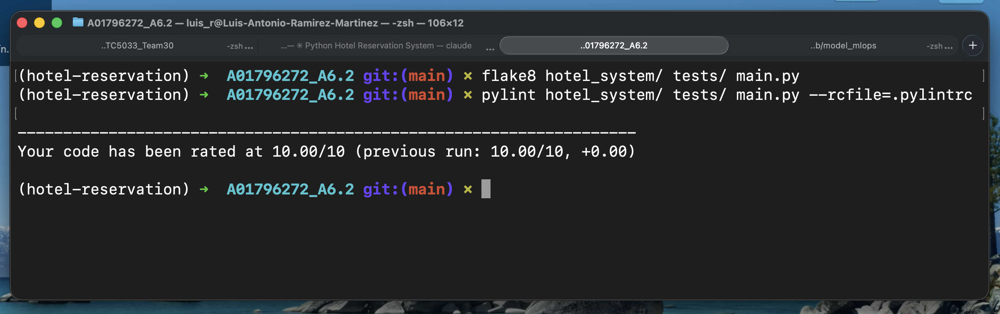

# Instituto Tecnológico de Estudios Superiores de Monterrey
## Maestría en Inteligencia Artificial Aplicada
## Pruebas de software y aseguramiento de la calidad
## 6.2 Ejercicio de programación 3 y pruebas de unidad
### A01796272 - Luis Antonio Ramírez Martínez

---

## Descripción

Sistema de gestión de hoteles, clientes y reservaciones implementado en Python.
Permite crear, consultar, modificar y eliminar registros de hoteles y clientes,
así como realizar y cancelar reservaciones de habitaciones. La persistencia de
datos se maneja mediante archivos JSON.

---

## Estructura del proyecto

```
A01796272_A6.2/
├── hotel_system/
│   ├── __init__.py
│   ├── hotel.py          # Clase Hotel
│   ├── customer.py       # Clase Customer
│   └── reservation.py    # Clase Reservation
├── tests/
│   ├── __init__.py
│   ├── test_hotel.py
│   ├── test_customer.py
│   └── test_reservation.py
├── data/                 # Generado en tiempo de ejecución (JSON)
│   ├── hotels.json
│   ├── customers.json
│   └── reservations.json
├── main.py               # Menú interactivo por consola
├── environment.yml       # Entorno Conda
├── .pylintrc             # Configuración de Pylint
├── .gitignore
└── readme.md
```

---

## Clases principales

### `Hotel`
| Atributo | Tipo | Descripción |
|---|---|---|
| `hotel_id` | str | Identificador único |
| `name` | str | Nombre del hotel |
| `location` | str | Ciudad o dirección |
| `rating` | float | Calificación (0.0 – 5.0) |
| `total_rooms` | int | Total de habitaciones |
| `available_rooms` | int | Habitaciones disponibles |
| `reservations` | list | IDs de reservaciones activas |

**Métodos:** `create`, `delete`, `display`, `modify`, `reserve_room`, `cancel_reservation`

### `Customer`
| Atributo | Tipo | Descripción |
|---|---|---|
| `customer_id` | str | Identificador único |
| `name` | str | Nombre completo |
| `email` | str | Correo electrónico |
| `phone` | str | Teléfono de contacto |

**Métodos:** `create`, `delete`, `display`, `modify`

### `Reservation`
| Atributo | Tipo | Descripción |
|---|---|---|
| `reservation_id` | str | Identificador único |
| `customer_id` | str | Cliente asociado |
| `hotel_id` | str | Hotel asociado |
| `check_in` | str | Fecha de entrada (YYYY-MM-DD) |
| `check_out` | str | Fecha de salida (YYYY-MM-DD) |
| `status` | str | `active` / `cancelled` |

**Métodos:** `create`, `cancel`, `display`, `validate_dates`

---

## Instalación

### Opción A — Conda (recomendado)

```bash
conda env create -f environment.yml
conda activate hotel-reservation
```

### Opción B — pip

```bash
pip install flake8 pylint coverage
```

---

## Uso

### Aplicación interactiva

```bash
python main.py
```

Al ejecutarlo se despliega un menú principal:

```
==========================================
    Hotel Reservation System
==========================================

=== Main Menu ===
1. Hotels
2. Customers
3. Reservations
0. Exit
```

### Flujo típico

1. Crear un hotel (`Hotels → 1`)
2. Crear un cliente (`Customers → 1`)
3. Crear una reservación (`Reservations → 1`) — requiere hotel y cliente existentes
4. Cancelar reservación (`Reservations → 2`)

---

## Pruebas unitarias

```bash
# Ejecutar todas las pruebas
python -m pytest tests/ -v

# Con reporte de cobertura
python -m coverage run -m pytest tests/
python -m coverage report --include="hotel_system/*"
```

### Resultados

| Módulo | Líneas | Cobertura |
|---|---|---|
| `hotel_system/hotel.py` | 137 | 100% |
| `hotel_system/customer.py` | 97 | 100% |
| `hotel_system/reservation.py` | 116 | 100% |
| **Total** | **350** | **100%** |

Total de pruebas: **73 casos** — todos pasan.

---

## Análisis estático

```bash
# Flake8 (PEP 8)
flake8 hotel_system/ tests/ main.py --max-line-length=79

# Pylint
pylint hotel_system/ tests/ main.py --rcfile=.pylintrc
```

| Herramienta | Resultado |
|---|---|
| Flake8 | 0 advertencias |
| Pylint | 10.00 / 10 |


# Resultado final


---

## Manejo de errores

El sistema tolera datos inválidos en los archivos JSON sin detener la ejecución:

- **JSON corrupto** — se imprime un mensaje de error y se retorna un diccionario vacío.
- **Registro con campos faltantes** — el registro se omite y la ejecución continúa.
- **Error de lectura/escritura (OS)** — se notifica por consola y el programa sigue corriendo.

Todos estos escenarios están cubiertos por pruebas unitarias.

---

## Requisitos cumplidos

| Requisito | Estado |
|---|---|
| Clases Hotel, Customer, Reservation | ✓ |
| Persistencia en archivos (CRUD completo) | ✓ |
| Pruebas unitarias con `unittest` | ✓ |
| Cobertura ≥ 85% | ✓ (100%) |
| Manejo de datos inválidos en archivos | ✓ |
| Cumplimiento PEP 8 | ✓ |
| Sin advertencias Flake8 / Pylint | ✓ |
